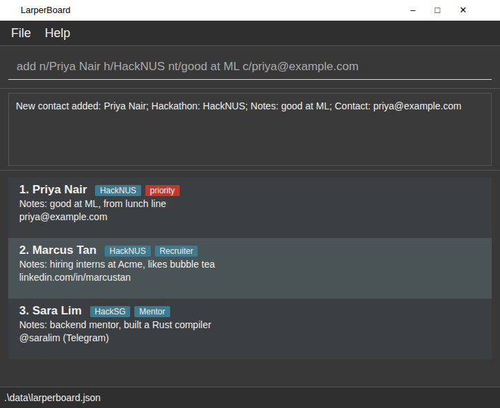

# LarperBoard

**LarperBoard is a desktop app for hackathon participants to log, find and follow up with the people they meet.** It is optimised for fast typing: a short command records a contact and the detail that will jog your memory later, so networking doesn't get in the way of building.

* **Target users:** students who attend many hackathons, keep a laptop open the whole time, and are comfortable with typing commands.
* **Quick capture:** add a person with their name, what they are building, a note, and a way to reach them, in a single line.
* **Organise and search:** tag contacts by hackathon or team, and search by name or by the notes you wrote.
* **Follow up:** mark priority contacts and export everything, notes included, as CSV or plain text to paste into LinkedIn or email.
* **Keep hackathons separate:** each hackathon's contacts stay together, while people you meet again can be looked up instead of duplicated. Archive contacts you have already followed up with.
* It has a GUI, but most interactions happen through a Command Line Interface (CLI).

## Documentation

* Using LarperBoard: see the [**User Guide**](docs/UserGuide.md).
* Developing LarperBoard: see the [**Developer Guide**](docs/DeveloperGuide.md).
* Meet the team: [**About Us**](docs/AboutUs.md).

## Acknowledgements

* This project is based on the AddressBook-Level3 project created by the [SE-EDU initiative](https://se-education.org).
* Libraries used: [JavaFX](https://openjfx.io/), [Jackson](https://github.com/FasterXML/jackson), [JUnit5](https://github.com/junit-team/junit5)
