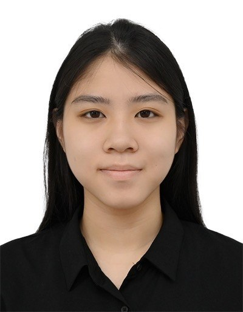
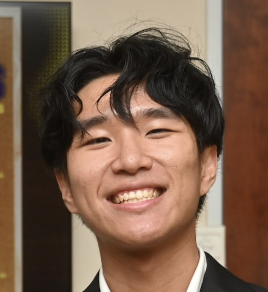

We are a team based in the [School of Computing, National University of Singapore](https://www.comp.nus.edu.sg).

You can reach us at the email `seer[at]comp.nus.edu.sg`

## Project team

### John Doe

[[homepage](http://www.comp.nus.edu.sg/~damithch)]
[[github](https://github.com/johndoe)]
[[portfolio](team/johndoe.md)]

* Role: Project Advisor

### Lee Jia Jie

[[github](http://github.com/jiewue)]
[[portfolio](team/jiewue.md)]

* Role: -
* Responsibilities: -

### Johnny Doe

[[github](http://github.com/johndoe)] [[portfolio](team/johndoe.md)]

* Role: Developer
* Responsibilities: Data

### Cheryl

[[github](https://github.com/Atqui-404)]

* Role: Developer
* Responsibilities: UI

### Cysiac

[[github](http://github.com/cysiac)]

* Role: Developer / Claude Expert
* Responsibilities: Develop Features + Educate the rest on usage of Claude
